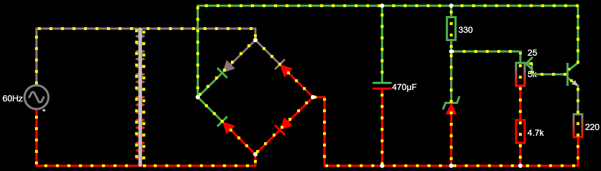

# **Trabalho Eletrônica Fonte**
## **SCC0180 - Eletrônica para a Computação - Prof Simões** [GitHub](https://github.com/simoesusp)
--------
# **Trabalho desenvolvido pelos alunos:**
- **Diógenes Silva Pedro (Dio) - nUSP: 11883476** - [GitHub](https://github.com/DioUSP)
- **Rodrigo Lopes Assaf (Árabe) - nUSP: 11795530** - [GitHub](https://github.com/Roassaf)
- **Pedro Liduino do Nascimento (Rio) - nUSP: 11796847** - [GitHub]()
--------
# **Desenvolvimento:**
O intuito do projeto é desenvolver uma fonte elétrica que transforma a partir da tomada (no nosso caso 110V - corrente alteranada) em uma tensão que não seja prejudicial ao nosso circuito, tal tensão está entre 3 e 12 Volts em corrente contínua.
## **Esquema do Circuito:**
## 
## **Link para o circuito no [Falstad](http://tinyurl.com/yca5v5q7)** 
--------
| **Componente** | **Especificações** | **Valor(Unitário)** |
|:---------------:|:-------------:|:---------------:|
|Transformador | 15V e 300mA | [R$26,00](https://produto.mercadolivre.com.br/MLB-802952898-transformador-primario-0110-0110-secundario-015v-300ma-_JM?matt_tool=82322591&matt_word&gclid=EAIaIQobChMIhsubx8z_6QIVjoSRCh005QUsEAkYCiABEgKHK_D_BwE&quantity=1) |
|4x Diodo | 400V e 3A | [R$0,38](https://www.autoeletronica.net/produtos/diodo-retificador-1n5404) |
|Diodo Zener | 1W e 15V | [R$0,18](https://www.autoeletronica.net/produtos/diodo-zener-1n4744a-15v-1w) |
|Capacitor | 1mF | [R$2,87](https://produto.mercadolivre.com.br/MLB-1499835576-capacitor-eletrolitico-1mf-x-400v-kit-c10-pcs-_JM?quantity=1#position=1&type=item&tracking_id=fa215f29-9e58-4df8-935f-7aea9beaf1e2) |
|Potenciômetro | 5kΩ | [R$1,52](https://www.americanas.com.br/produto/212584212/potenciometro-linear-5k-16mm-eixo-estriado?WT.srch=1&acc=e789ea56094489dffd798f86ff51c7a9&epar=bp_pl_00_go_inf-aces_acessorios_geral_gmv&gclid=EAIaIQobChMIlqedgtb_6QIVwoORCh24ZwAEEAkYAiABEgI6w_D_BwE&i=5d712b2d49f937f6250d8225&o=5d6e754f6c28a3cb50909602&opn=YSMESP&sellerid=10428528000110) |
|Resistência | 120Ω | [R$0,23](https://produto.mercadolivre.com.br/MLB-1278829161-100x-104615-resistor-025w-120-ohms-carvo-_JM?quantity=1#position=5&type=item&tracking_id=3da44ff8-1b4b-4355-aedb-9b4564d157de) |
|Resistência | 330Ω | [R$0,13](https://produto.mercadolivre.com.br/MLB-1342907792-resistor-330-ohms-100-unidades-_JM?quantity=1#position=1&type=item&tracking_id=64df90b6-86bd-4de3-8a9f-d59c6ad031f4) |
|Resistência | 2kΩ | [R$0,17](https://produto.mercadolivre.com.br/MLB-1359755617-100un-resistor-18w-2k-2000-ohms-_JM?quantity=1#position=1&type=item&tracking_id=cfe0aced-991b-46f7-ad48-868c569c5428) |
|Switch | 250V e 3A | [R$8,00](https://produto.mercadolivre.com.br/MLB-1300399738-boto-chave-gangorra-mini-interruptor-liga-desliga-on-off-10x15mm-kcd13-101-3a-250v-arduino-_JM?variation=42249952649&quantity=1#reco_item_pos=0&reco_backend=machinalis-seller-items-pdp&reco_backend_type=low_level&reco_client=vip-seller_items-above&reco_id=3b5ba658-e897-4edb-bdb5-659b62db67cc) |
|Custo Total | | **R$40,62** |
## **Justificativa dos componentes escolhidos:**
1. Transformador:
    * Transforma a corrente alternada de 127V em uma corrente, ainda alternada, de 17V, assim ficamos mais próximos da tensão de entre 3 e 12V desejada 
2. Ponte Retificadora:
    * Transforma a corrente alternada de ~17V em uma corrente contínua de ~16V com ~342 nA
3. Capacitor:
    * O intuito do capacitor é guardar corrente e com isso liberá-la quando necessário para o circuito. Como queremos manter a tensão máxima o mais próximo possível de 12V, usaremos um capacitor de 1 micro Faraday. 
4. Diodo Zener:
    * Transformar a corrente alternada que vem da tomada e consequentemente do transformador em corrente contínua, como ele tem ~6mA e ~13V temos P = i.u -> P = 0,006 * 13 -> P = 0,78W -> P = 780 mW então um diodo de 1W se faz suficiente.
5. Potenciômetro:
    * Resistor variável que controla qual a tensão atual no circuito, no nosso caso temos um mínimo de ~2.7V e um máximo de ~12.2V
6. Resistência:
    * 120Ω: Ajuda a regular a tensão de saída
    * 330Ω: Limita a corrente que passa pelo Zener, cujo qual não pode ter uma potência maior que 1W ou uma tensão maior que 15V
    * 2kΩ: Ajuda a regular a tensão de base que volta ao transformador e consequentemente a voltagem final do circuito
7. Switch:
    * Ligar e desligar o circuito
--------
# Agradecimentos:
Agradecer ao Professor Simões por mesmo em tempos difíceis como os atuais estar se esforçando para o decorrer da disciplina. O grupo espera que tudo esteja bem e espera que assim que possível possa voltar a reencontrar o professor presencialmente pelo Campus ou no ICMC.

