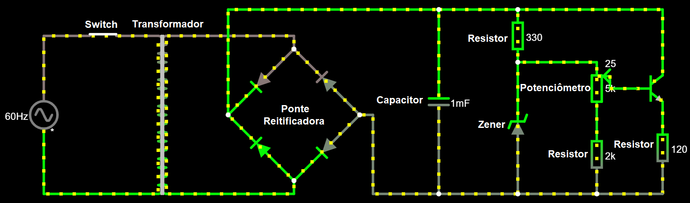

# Trabalho Eletrônica Fonte
## SCC0180 - Eletrônica para a Computação - Prof Simões [GitHub](https://github.com/simoesusp)
--------
# Trabalho desenvolvido pelos alunos:
### - Diógenes Silva Pedro - nUSP: 11883476 - [GitHub](https://github.com/DioUSP)
### - Rodrigo Lopes Assaf - nUSP: 11795530 - [GitHub](https://github.com/Roassaf)
### - Pedro Liduino do Nascimento - nUSP: 11796847 - [GitHub]()
--------
# Desenvolvimento:
## Circuito: 
## 
## Link para o [Circuito](http://tinyurl.com/y86d6b6e) 
--------
| Componente      | Especificações|Valor(Unitário)  |
|:---------------:|:-------------:|:---------------:|
|Transformador    | 15V e 300mA   | [R$26,00](https://produto.mercadolivre.com.br/MLB-802952898-transformador-primario-0110-0110-secundario-015v-300ma-_JM?matt_tool=82322591&matt_word&gclid=EAIaIQobChMIhsubx8z_6QIVjoSRCh005QUsEAkYCiABEgKHK_D_BwE&quantity=1)|
|Diodo | 400V e 3A | [R$0,38](https://www.autoeletronica.net/produtos/diodo-retificador-1n5404) |
|Diodo Zener | 1W e 12V | [R$0,15](https://www.autoeletronica.net/produtos/diodo-zener-1n4742a-12v-1w) |
|Capacitor | 1mF e 400V | [R$2,87](https://produto.mercadolivre.com.br/MLB-1499835576-capacitor-eletrolitico-1mf-x-400v-kit-c10-pcs-_JM?quantity=1#position=1&type=item&tracking_id=fa215f29-9e58-4df8-935f-7aea9beaf1e2) |
|Potenciometro | 5kΩ | [R$1,52](https://www.americanas.com.br/produto/212584212/potenciometro-linear-5k-16mm-eixo-estriado?WT.srch=1&acc=e789ea56094489dffd798f86ff51c7a9&epar=bp_pl_00_go_inf-aces_acessorios_geral_gmv&gclid=EAIaIQobChMIlqedgtb_6QIVwoORCh24ZwAEEAkYAiABEgI6w_D_BwE&i=5d712b2d49f937f6250d8225&o=5d6e754f6c28a3cb50909602&opn=YSMESP&sellerid=10428528000110) |
|Resistência | 220Ω | [R$0,13](https://produto.mercadolivre.com.br/MLB-1345214690-resistor-220-ohms-100-unidades-_JM?quantity=1#position=1&type=item&tracking_id=d8efcfff-32d5-4d41-b944-c3f3722406a6) |
|Resistência | 330Ω | [R$0,13](https://produto.mercadolivre.com.br/MLB-1342907792-resistor-330-ohms-100-unidades-_JM?matt_tool=79246729&matt_word&gclid=EAIaIQobChMIuqTRqdz_6QIVFYCRCh34pgaiEAkYASABEgLngfD_BwE&quantity=1) |
|Resistência | 2kΩ | [R$0,17](https://produto.mercadolivre.com.br/MLB-1359755617-100un-resistor-18w-2k-2000-ohms-_JM?quantity=1#position=1&type=item&tracking_id=cfe0aced-991b-46f7-ad48-868c569c5428) |
|Switch | 250V e 3A | [R$8,00](https://produto.mercadolivre.com.br/MLB-1300399738-boto-chave-gangorra-mini-interruptor-liga-desliga-on-off-10x15mm-kcd13-101-3a-250v-arduino-_JM?variation=42249952649&quantity=1#reco_item_pos=0&reco_backend=machinalis-seller-items-pdp&reco_backend_type=low_level&reco_client=vip-seller_items-above&reco_id=3b5ba658-e897-4edb-bdb5-659b62db67cc) |
|Custo Total | | **R$39,35** |
## Justificativa dos componentes escolhidos:
### !!!A fazer!!!